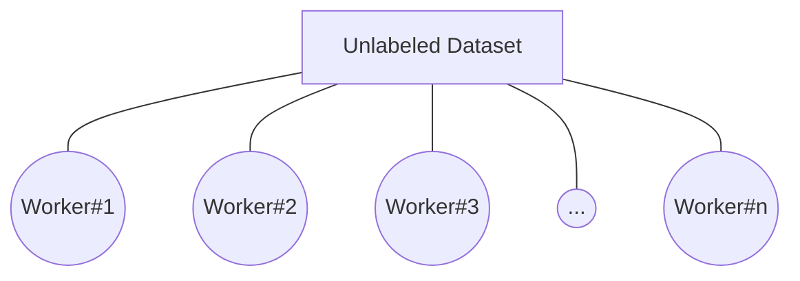

# MeshLabeler
**MeshLabeler** is a tool to help label the unlabeled (*i.e new or self made*) dataset manually over a private network so that together can make the task easier with a friendly UI.

### Supported :

| **Data type** | **File** | **Perform** | **Status**
| Text | csv | Multi-label, Label | Developing
| Image | jpg | Segmentation, Label, Multi-label, Annotation |Not yet
| Video | mp4 | Segmentation, Label, Multi-label |Not yet
| Audio | wav | Segmentation, Label, Multi-label |Not yet

###**Limitation :**

 - Manage only one dataset at a time.
 - Save file will produce a file.
